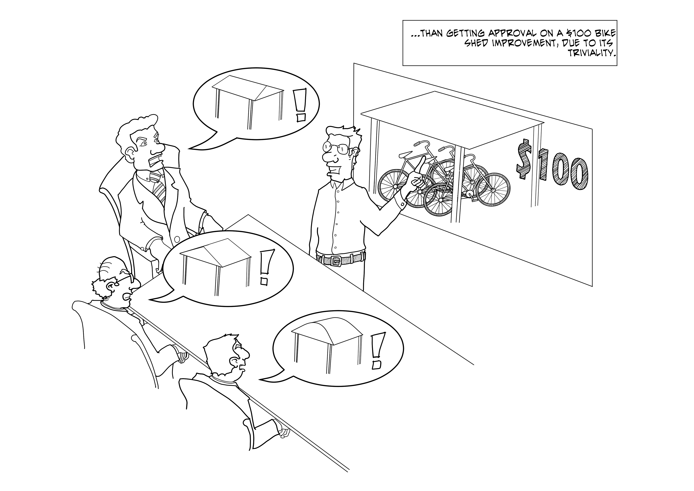

Lghtweight APIs with harvester.js
==========
Or *how I learned to stop worrying and love Node.js APIs*

Who am I?
---------
A nerd, working at UniRitter and AGCO.

And what is this AGCO thing?
-------------------------------
* We build tractors, sprayers, harvesters (nudge, nudge) and other machinery
* We build the tech to connect them all
* And this is pretty high-tech stuff

Core beliefs
------------
* distributed over centralized
* just enough over overengineering
* gradual evolution over big bangs
* simple over easy

Inspiration
-----------
* Agile manifesto
* 12-factor apps
* Reactive manifesto

Core practices
--------------
* emerging architecture:
	- YAGNI & DRY 
	- point-to-point integration
	- lightweight APIs
* and our personal favorite: no bikeshedding
 
On bikeshedding
---------------

 
On bikeshedding
---------------

In comes JSONAPI
----------------

And there's more...
-------------------
* Working on the 2.0 specs

Q&A

Why node?
---------

Why Mongo?
----------

Why ElasticSearch?
------------------

Why server-sent events?
-----------------------